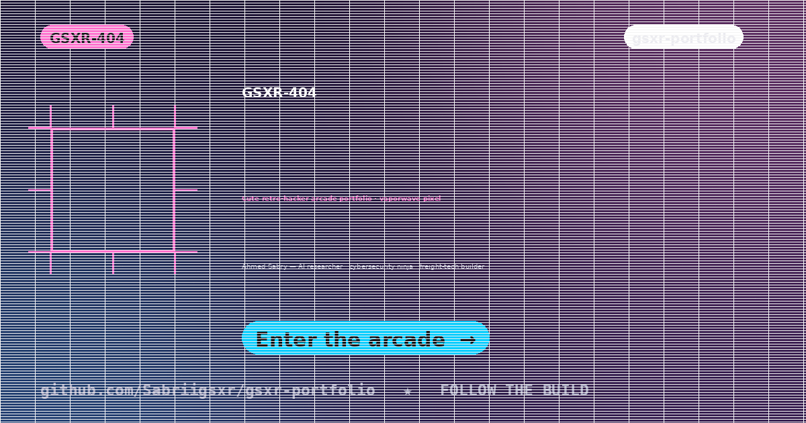

<p align="center">
  
</p>

<h1 align="center">★ GSXR-404 — Cute Retro-Hacker Arcade Portfolio ★</h1>

<p align="center">
  <b>PLAYER: AHMED SABRY</b> · CLASS: AI Researcher / Cybersecurity Ninja · QUEST: build smart logistics,
  hack things for good, and level up the web.
</p>

<p align="center">
  
  
  
  
  
</p>

---

## 🕹️ What is this?

A **vaporwave arcade landing** for my personal brand — pastel pixel aesthetics, CRT
scanlines, a canvas starfield and a typewriter terminal. No frameworks, no build step:
pure HTML/CSS/JS that you can FTP to any host and play.

> **CURRENTLY GRINDING:** zero-trust ML pipelines & freight optimization 🚢🤖

## ✨ Features

- 🌌 **Canvas starfield** + CRT scanline overlay
- ⌨️ **Typewriter terminal** hero intro with blinking cursor
- 👾 **Player Profile** page — stat bars, bio readout, timeline
- 🕹️ **Arcade-cabinet project grid** — every project is a playable machine
- 📰 **Blog engine** — archive + single-post template
- ✉️ **Contact "TRANSMIT MESSAGE"** — Formspree integration + success page
- 📱 **Fully responsive** with `prefers-reduced-motion` support
- 🧱 **Inline SVG pixel icons** — zero emoji, crisp at every size

## 🎨 Palette

```
BG        #1a1033 → #2d1b4e   (deep vaporwave night)
PINK      #FF71CE             CYAN  #01CDFE
MINT      #05FFA1             YELLOW #FFFB96
PURPLE    #B967FF             TEXT  #F5E6FF
```

## 🚀 Quick Start

```bash
# no build, no install — just serve it
python3 -m http.server 8000
# → http://localhost:8000
```

Or drop the folder on **GoDaddy / Netlify / GitHub Pages / any FTP host**. Done.

## 📂 Structure

```
portfolio_site/
├── index.html      # Arcade landing (single scroll)
├── about.html      # Player profile: stats, bio, timeline
├── projects.html   # Arcade-cabinet project cards
├── blog.html       # Blog archive
├── post.html       # Single post template
├── contact.html    # TRANSMIT MESSAGE (Formspree)
├── thanks.html     # Form success landing
├── css/
│   ├── style.css         # Tokens + components
│   └── responsive.css    # Breakpoints
├── js/
│   ├── main.js           # Starfield, typewriter, scroll reveal
│   └── form.js           # Formspree handling
└── assets/img/           # OG image, avatar, favicon (SVG-first)
```

## 🗺️ Roadmap

- [ ] Services page with neon cards
- [ ] Newsletter capture + automations
- [ ] PageSpeed 90+ on mobile & desktop
- [ ] Blog CMS (markdown → static)

## 👤 Author

**Ahmed Sabry (GSXR-404)** — AI researcher · cybersecurity ninja · freight-tech builder

- GitHub: [@Sabriigsxr](https://github.com/Sabriigsxr)

## 📄 License

MIT — steal the vibe, build your own arcade.
